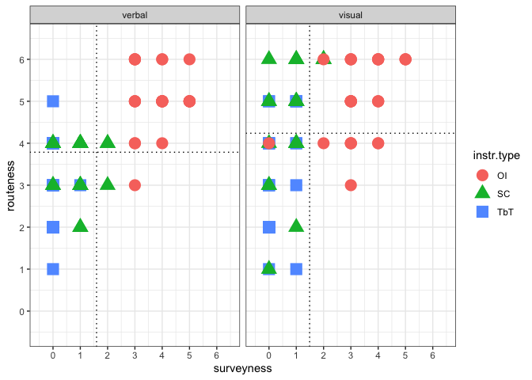

Data analysis for: The effect of orientation instructions on the recall
and reuse of route and survey elements in wayfinding descriptions
================
Jakub Krukar (<krukar@uni-muenster.de> / krukar.staff.ifgi.de)

Krukar, J., Anacta, V. J., & Schwering, A. (2020). The effect of
orientation instructions on the recall and reuse of route and survey
elements in wayfinding descriptions. *Journal of Environmental
Psychology, 68, 101407*. <https://doi.org/10.1016/j.jenvp.2020.101407>

The document lists citations from the paper that refer to some
statistical output, and follows the citation with a code chunk that
calculated this result. Section, table, and figure numbers are identical
as those in the paper.

# 5. Data analysis

## 5.4 Individual differences questionnaires

> Because most of the results of these two individual differences
> questionnaires significantly correlated in our sample (Mental Rotation
> Test and global self-confidence scale of the Questionnaire on Spatial
> Strategies: r = .24, p = .028; Mental Rotation Test and the preference
> for an allocentric reference frame scale of the Questionnaire on
> Spatial Strategies: r = .23, p = .034; Mental Rotation Test and the
> preference for the knowledge of cardinal directions scale of the
> Questionnaire on Spatial Strategies: r = .12, p = .289), we do not use
> them simultaneously as predictors in our models in order to avoid the
> issue of multicollinearity.

``` r
x <- df.sr %>%
  group_by(part.ID) %>%
  summarise(
    MRT = unique(MRT1SCORE),
    scale1 = unique(GlobalSelfConfidence),
    scale2 = unique(SurveyStrtegy),
    scale3 = unique(CardinalDirKnow)
  )
cor.test(x$MRT, x$scale1)
```

    ## 
    ##  Pearson's product-moment correlation
    ## 
    ## data:  x$MRT and x$scale1
    ## t = 2.2314, df = 82, p-value = 0.02838
    ## alternative hypothesis: true correlation is not equal to 0
    ## 95 percent confidence interval:
    ##  0.02621369 0.43152347
    ## sample estimates:
    ##       cor 
    ## 0.2392642

``` r
cor.test(x$MRT, x$scale2)
```

    ## 
    ##  Pearson's product-moment correlation
    ## 
    ## data:  x$MRT and x$scale2
    ## t = 2.1526, df = 82, p-value = 0.03429
    ## alternative hypothesis: true correlation is not equal to 0
    ## 95 percent confidence interval:
    ##  0.01775735 0.42461338
    ## sample estimates:
    ##       cor 
    ## 0.2312721

``` r
cor.test(x$MRT, x$scale3)
```

    ## 
    ##  Pearson's product-moment correlation
    ## 
    ## data:  x$MRT and x$scale3
    ## t = 1.0677, df = 82, p-value = 0.2888
    ## alternative hypothesis: true correlation is not equal to 0
    ## 95 percent confidence interval:
    ##  -0.09980727  0.32337069
    ## sample estimates:
    ##       cor 
    ## 0.1170935

# 6 Results

## 6.1 Quantity of route- and survey-related information

### 6.1.1 Visual mode

> In the visual mode, (…) Participants receiving turn-by-turn
> instructions, on average, included 2.9 local landmarks in their sketch
> maps; those in the spatial chunking condition reused an average of 6.9
> local landmarks; and those who saw orientation instructions included 9
> local landmarks on average

Average number of Local Landmarks per instruction type:

``` r
vis %>%
  filter(ldnm.type != "GL") %>%
  group_by(instr.type, part.ID) %>%
  summarise(no.ldnm = sum(included)) %>%
  group_by(instr.type) %>%
  summarise(avg.no.ldnm = mean(no.ldnm))
```

    ## # A tibble: 3 x 2
    ##   instr.type avg.no.ldnm
    ## * <fct>            <dbl>
    ## 1 OI                9   
    ## 2 SC                6.93
    ## 3 TbT               2.93

> …plus an additional 2.2 global landmarks on average.

Average number of Global Landmarks per instruction type:

``` r
vis %>%
  filter(ldnm.type == "GL") %>%
  group_by(instr.type, part.ID) %>%
  summarise(no.ldnm = sum(included)) %>%
  group_by(instr.type) %>%
  summarise(avg.no.ldnm = mean(no.ldnm))
```

    ## `summarise()` has grouped output by 'instr.type'. You can override using the `.groups` argument.

    ## # A tibble: 1 x 2
    ##   instr.type avg.no.ldnm
    ## * <fct>            <dbl>
    ## 1 OI                2.18

> To test the global landmark recall rate, we conducted a one-sample
> t-test, comparing the number of global landmarks recalled by
> participants in the orientation instructions condition (M = 2.2, SD =
> 0.6), to number 0. This test was significant t(27) = 18.84, p &lt;
> .001.

``` r
xyz1 <- vis %>%
  filter(ldnm.type == "GL") %>%
  group_by(instr.type, part.ID) %>%
  summarise(no.ldnm = sum(included)) %>%
  group_by(instr.type)
```

    ## `summarise()` has grouped output by 'instr.type'. You can override using the `.groups` argument.

``` r
t.test(xyz1$no.ldnm, mu = 0, alternative = "greater")
```

    ## 
    ##  One Sample t-test
    ## 
    ## data:  xyz1$no.ldnm
    ## t = 18.842, df = 27, p-value < 0.00000000000000022
    ## alternative hypothesis: true mean is greater than 0
    ## 95 percent confidence interval:
    ##  1.981628      Inf
    ## sample estimates:
    ## mean of x 
    ##  2.178571

> Alternative models including other measures of individual differences
> were tested, but only the global self-confidence scale significantly
> improved the model’s fit compared to the null model (χ2(1) = 8.26, p =
> .004).

``` r
# prepare data for models
vis2 <- vis %>% filter(ldnm.type != "GL")
vis2$landmark <- as.character(vis2$landmark)
vis2$landmark <- str_replace(vis2$landmark, "\\(GasStation\\(Right\\).SCVis", "Gas")
vis2$landmark <- str_replace(vis2$landmark, "Café", "Cafe")
vis2$landmark <- word(vis2$landmark, 1, sep = "\\(")
vis2$landmark <- word(vis2$landmark, 1, sep = "\\.")
vis2$landmark <- as.factor(vis2$landmark)


vis40 <- glmer(included ~ instr.type +
  (1 | part.ID) + (1 + instr.type | landmark), data = vis2, family = binomial("logit"), control = glmerControl(optimizer = "bobyqa", optCtrl = list(maxfun = 2e5)))
vis41 <- glmer(included ~ instr.type + GlobalSelfConfidence +
  (1 | part.ID) + (1 + instr.type | landmark), data = vis2, family = binomial("logit"), control = glmerControl(optimizer = "bobyqa", optCtrl = list(maxfun = 2e5)))
vis42 <- glmer(included ~ instr.type + SurveyStrtegy +
  (1 | part.ID) + (1 + instr.type | landmark), data = vis2, family = binomial("logit"), control = glmerControl(optimizer = "bobyqa", optCtrl = list(maxfun = 2e5)))
vis43 <- glmer(included ~ instr.type + CardinalDirKnow +
  (1 | part.ID) + (1 + instr.type | landmark), data = vis2, family = binomial("logit"), control = glmerControl(optimizer = "bobyqa", optCtrl = list(maxfun = 2e5)))
vis44 <- glmer(included ~ instr.type + MRT1SCORE +
  (1 | part.ID) + (1 + instr.type | landmark), data = vis2, family = binomial("logit"), control = glmerControl(optimizer = "bobyqa", optCtrl = list(maxfun = 2e5)))

anova(vis40, vis41, vis42, vis43, vis44)
```

    ## Data: vis2
    ## Models:
    ## vis40: included ~ instr.type + (1 | part.ID) + (1 + instr.type | landmark)
    ## vis41: included ~ instr.type + GlobalSelfConfidence + (1 | part.ID) + 
    ## vis41:     (1 + instr.type | landmark)
    ## vis42: included ~ instr.type + SurveyStrtegy + (1 | part.ID) + (1 + 
    ## vis42:     instr.type | landmark)
    ## vis43: included ~ instr.type + CardinalDirKnow + (1 | part.ID) + (1 + 
    ## vis43:     instr.type | landmark)
    ## vis44: included ~ instr.type + MRT1SCORE + (1 | part.ID) + (1 + instr.type | 
    ## vis44:     landmark)
    ##       npar    AIC    BIC  logLik deviance  Chisq Df Pr(>Chisq)   
    ## vis40   10 1020.0 1069.2 -500.02  1000.04                        
    ## vis41   11 1013.8 1067.9 -495.89   991.78 8.2588  1   0.004056 **
    ## vis42   11 1019.6 1073.7 -498.82   997.64 0.0000  0              
    ## vis43   11 1021.2 1075.3 -499.62   999.23 0.0000  0              
    ## vis44   11 1022.0 1076.1 -500.01  1000.01 0.0000  0              
    ## ---
    ## Signif. codes:  0 '***' 0.001 '**' 0.01 '*' 0.05 '.' 0.1 ' ' 1

> Table 3. A logit mixed model describing the impact of instruction type
> and the global self-confidence scale questionnaire score on the odds of
> including a landmark in the sketch map, in the visual mode.

``` r
tab_model(vis41)
```

<table style="border-collapse:collapse; border:none;">
<tr>
<th style="border-top: double; text-align:center; font-style:normal; font-weight:bold; padding:0.2cm;  text-align:left; ">
 
</th>
<th colspan="3" style="border-top: double; text-align:center; font-style:normal; font-weight:bold; padding:0.2cm; ">
included
</th>
</tr>
<tr>
<td style=" text-align:center; border-bottom:1px solid; font-style:italic; font-weight:normal;  text-align:left; ">
Predictors
</td>
<td style=" text-align:center; border-bottom:1px solid; font-style:italic; font-weight:normal;  ">
Odds Ratios
</td>
<td style=" text-align:center; border-bottom:1px solid; font-style:italic; font-weight:normal;  ">
CI
</td>
<td style=" text-align:center; border-bottom:1px solid; font-style:italic; font-weight:normal;  ">
p
</td>
</tr>
<tr>
<td style=" padding:0.2cm; text-align:left; vertical-align:top; text-align:left; ">
(Intercept)
</td>
<td style=" padding:0.2cm; text-align:left; vertical-align:top; text-align:center;  ">
1.09
</td>
<td style=" padding:0.2cm; text-align:left; vertical-align:top; text-align:center;  ">
0.29 – 4.18
</td>
<td style=" padding:0.2cm; text-align:left; vertical-align:top; text-align:center;  ">
0.896
</td>
</tr>
<tr>
<td style=" padding:0.2cm; text-align:left; vertical-align:top; text-align:left; ">
instr.type \[SC\]
</td>
<td style=" padding:0.2cm; text-align:left; vertical-align:top; text-align:center;  ">
0.27
</td>
<td style=" padding:0.2cm; text-align:left; vertical-align:top; text-align:center;  ">
0.10 – 0.75
</td>
<td style=" padding:0.2cm; text-align:left; vertical-align:top; text-align:center;  ">
<strong>0.012</strong>
</td>
</tr>
<tr>
<td style=" padding:0.2cm; text-align:left; vertical-align:top; text-align:left; ">
instr.type \[TbT\]
</td>
<td style=" padding:0.2cm; text-align:left; vertical-align:top; text-align:center;  ">
0.04
</td>
<td style=" padding:0.2cm; text-align:left; vertical-align:top; text-align:center;  ">
0.02 – 0.11
</td>
<td style=" padding:0.2cm; text-align:left; vertical-align:top; text-align:center;  ">
<strong>&lt;0.001
</td>
</tr>
<tr>
<td style=" padding:0.2cm; text-align:left; vertical-align:top; text-align:left; ">
GlobalSelfConfidence
</td>
<td style=" padding:0.2cm; text-align:left; vertical-align:top; text-align:center;  ">
1.40
</td>
<td style=" padding:0.2cm; text-align:left; vertical-align:top; text-align:center;  ">
1.12 – 1.75
</td>
<td style=" padding:0.2cm; text-align:left; vertical-align:top; text-align:center;  ">
<strong>0.003</strong>
</td>
</tr>
<tr>
<td colspan="4" style="font-weight:bold; text-align:left; padding-top:.8em;">
Random Effects
</td>
</tr>
<tr>
<td style=" padding:0.2cm; text-align:left; vertical-align:top; text-align:left; padding-top:0.1cm; padding-bottom:0.1cm;">
σ<sup>2</sup>
</td>
<td style=" padding:0.2cm; text-align:left; vertical-align:top; padding-top:0.1cm; padding-bottom:0.1cm; text-align:left;" colspan="3">
3.29
</td>
<tr>
<td style=" padding:0.2cm; text-align:left; vertical-align:top; text-align:left; padding-top:0.1cm; padding-bottom:0.1cm;">
τ<sub>00</sub> <sub>part.ID</sub>
</td>
<td style=" padding:0.2cm; text-align:left; vertical-align:top; padding-top:0.1cm; padding-bottom:0.1cm; text-align:left;" colspan="3">
0.61
</td>
<tr>
<td style=" padding:0.2cm; text-align:left; vertical-align:top; text-align:left; padding-top:0.1cm; padding-bottom:0.1cm;">
τ<sub>00</sub> <sub>landmark</sub>
</td>
<td style=" padding:0.2cm; text-align:left; vertical-align:top; padding-top:0.1cm; padding-bottom:0.1cm; text-align:left;" colspan="3">
2.03
</td>
<tr>
<td style=" padding:0.2cm; text-align:left; vertical-align:top; text-align:left; padding-top:0.1cm; padding-bottom:0.1cm;">
τ<sub>11</sub> <sub>landmark.instr.typeSC</sub>
</td>
<td style=" padding:0.2cm; text-align:left; vertical-align:top; padding-top:0.1cm; padding-bottom:0.1cm; text-align:left;" colspan="3">
2.11
</td>
<tr>
<td style=" padding:0.2cm; text-align:left; vertical-align:top; text-align:left; padding-top:0.1cm; padding-bottom:0.1cm;">
τ<sub>11</sub> <sub>landmark.instr.typeTbT</sub>
</td>
<td style=" padding:0.2cm; text-align:left; vertical-align:top; padding-top:0.1cm; padding-bottom:0.1cm; text-align:left;" colspan="3">
1.62
</td>
<tr>
<td style=" padding:0.2cm; text-align:left; vertical-align:top; text-align:left; padding-top:0.1cm; padding-bottom:0.1cm;">
ρ<sub>01</sub> <sub>landmark.instr.typeSC</sub>
</td>
<td style=" padding:0.2cm; text-align:left; vertical-align:top; padding-top:0.1cm; padding-bottom:0.1cm; text-align:left;" colspan="3">
-0.24
</td>
<tr>
<td style=" padding:0.2cm; text-align:left; vertical-align:top; text-align:left; padding-top:0.1cm; padding-bottom:0.1cm;">
ρ<sub>01</sub> <sub>landmark.instr.typeTbT</sub>
</td>
<td style=" padding:0.2cm; text-align:left; vertical-align:top; padding-top:0.1cm; padding-bottom:0.1cm; text-align:left;" colspan="3">
-0.62
</td>
<tr>
<td style=" padding:0.2cm; text-align:left; vertical-align:top; text-align:left; padding-top:0.1cm; padding-bottom:0.1cm;">
ICC
</td>
<td style=" padding:0.2cm; text-align:left; vertical-align:top; padding-top:0.1cm; padding-bottom:0.1cm; text-align:left;" colspan="3">
0.46
</td>
<tr>
<td style=" padding:0.2cm; text-align:left; vertical-align:top; text-align:left; padding-top:0.1cm; padding-bottom:0.1cm;">
N <sub>part.ID</sub>
</td>
<td style=" padding:0.2cm; text-align:left; vertical-align:top; padding-top:0.1cm; padding-bottom:0.1cm; text-align:left;" colspan="3">
84
</td>
<tr>
<td style=" padding:0.2cm; text-align:left; vertical-align:top; text-align:left; padding-top:0.1cm; padding-bottom:0.1cm;">
N <sub>landmark</sub>
</td>
<td style=" padding:0.2cm; text-align:left; vertical-align:top; padding-top:0.1cm; padding-bottom:0.1cm; text-align:left;" colspan="3">
12
</td>
<tr>
<td style=" padding:0.2cm; text-align:left; vertical-align:top; text-align:left; padding-top:0.1cm; padding-bottom:0.1cm; border-top:1px solid;">
Observations
</td>
<td style=" padding:0.2cm; text-align:left; vertical-align:top; padding-top:0.1cm; padding-bottom:0.1cm; text-align:left; border-top:1px solid;" colspan="3">
1008
</td>
</tr>
<tr>
<td style=" padding:0.2cm; text-align:left; vertical-align:top; text-align:left; padding-top:0.1cm; padding-bottom:0.1cm;">
Marginal R<sup>2</sup> / Conditional R<sup>2</sup>
</td>
<td style=" padding:0.2cm; text-align:left; vertical-align:top; padding-top:0.1cm; padding-bottom:0.1cm; text-align:left;" colspan="3">
0.234 / 0.586
</td>
</tr>
</table>

### 6.1.2 Verbal mode

> In the verbal mode, (…) Spatial chunking participants included on
> average 4.9 (out of 5) local landmarks, and the orientation
> instructions participants included on average 8.9 (out of 11) local
> landmarks

Average number of Local Landmarks per instruction type:

``` r
ver %>%
  filter(ldnm.type != "GL") %>%
  group_by(instr.type, part.ID) %>%
  summarise(no.ldnm = sum(included)) %>%
  group_by(instr.type) %>%
  summarise(avg.no.ldnm = mean(no.ldnm))
```

    ## # A tibble: 2 x 2
    ##   instr.type avg.no.ldnm
    ## * <fct>            <dbl>
    ## 1 OI                8.86
    ## 2 SC                4.86

> …plus an additional 1.9 global landmarks (out of 2), on average.

Average number of Global Landmarks per instruction type:

``` r
ver %>%
  filter(ldnm.type == "GL") %>%
  group_by(instr.type, part.ID) %>%
  summarise(no.ldnm = sum(included)) %>%
  group_by(instr.type) %>%
  summarise(avg.no.ldnm = mean(no.ldnm))
```

    ## `summarise()` has grouped output by 'instr.type'. You can override using the `.groups` argument.

    ## # A tibble: 1 x 2
    ##   instr.type avg.no.ldnm
    ## * <fct>            <dbl>
    ## 1 OI                1.89

> To test the global landmark recall rate, we conducted a one-sample,
> one-tailed t-test, comparing the number of global landmarks recalled
> by participants in the orientation instructions condition (M = 1.9, SD
> = 0.3) to number 0. This test was significant t(27) = 31.80, p &lt;
> .001.

``` r
xyz2 <- ver %>%
  filter(ldnm.type == "GL") %>%
  group_by(instr.type, part.ID) %>%
  summarise(no.ldnm = sum(included)) %>%
  group_by(instr.type)
```

    ## `summarise()` has grouped output by 'instr.type'. You can override using the `.groups` argument.

``` r
t.test(xyz2$no.ldnm, mu = 0, alternative = "greater")
```

    ## 
    ##  One Sample t-test
    ## 
    ## data:  xyz2$no.ldnm
    ## t = 31.8, df = 27, p-value < 0.00000000000000022
    ## alternative hypothesis: true mean is greater than 0
    ## 95 percent confidence interval:
    ##  1.791471      Inf
    ## sample estimates:
    ## mean of x 
    ##  1.892857

> Furthermore, the Mental Rotation Test score was the only individual
> difference, including which significantly improved the model’s fit
> compared to the null model (χ2(1) = 4.58, p = .032).

``` r
ver2 <- ver %>% filter(ldnm.type != "GL")

ver40 <- glmer(included ~ instr.type +
  (1 | part.ID) + (1 | instr.type:landmark), data = ver2, family = binomial("logit"))
ver41 <- glmer(included ~ instr.type + MRT1SCORE +
  (1 | part.ID) + (1 | instr.type:landmark), data = ver2, family = binomial("logit"))
ver42 <- glmer(included ~ instr.type + GlobalSelfConfidence +
  (1 | part.ID) + (1 | instr.type:landmark), data = ver2, family = binomial("logit"))
ver43 <- glmer(included ~ instr.type + SurveyStrtegy +
  (1 | part.ID) + (1 | instr.type:landmark), data = ver2, family = binomial("logit"))
ver44 <- glmer(included ~ instr.type + CardinalDirKnow +
  (1 | part.ID) + (1 | instr.type:landmark), data = ver2, family = binomial("logit"))
anova(ver40, ver41, ver42, ver43, ver44)
```

    ## Data: ver2
    ## Models:
    ## ver40: included ~ instr.type + (1 | part.ID) + (1 | instr.type:landmark)
    ## ver41: included ~ instr.type + MRT1SCORE + (1 | part.ID) + (1 | instr.type:landmark)
    ## ver42: included ~ instr.type + GlobalSelfConfidence + (1 | part.ID) + 
    ## ver42:     (1 | instr.type:landmark)
    ## ver43: included ~ instr.type + SurveyStrtegy + (1 | part.ID) + (1 | 
    ## ver43:     instr.type:landmark)
    ## ver44: included ~ instr.type + CardinalDirKnow + (1 | part.ID) + (1 | 
    ## ver44:     instr.type:landmark)
    ##       npar    AIC    BIC  logLik deviance  Chisq Df Pr(>Chisq)  
    ## ver40    4 305.93 322.35 -148.96   297.93                       
    ## ver41    5 303.35 323.87 -146.67   293.35 4.5829  1    0.03229 *
    ## ver42    5 307.19 327.72 -148.60   297.19 0.0000  0             
    ## ver43    5 307.67 328.19 -148.83   297.67 0.0000  0             
    ## ver44    5 307.36 327.89 -148.68   297.36 0.3055  0             
    ## ---
    ## Signif. codes:  0 '***' 0.001 '**' 0.01 '*' 0.05 '.' 0.1 ' ' 1

> Table 4. A logit mixed model describing the impact of instruction type
> and the Mental Rotation Test score on the odds of including a landmark
> in the sketch map, in the verbal mode.

``` r
tab_model(ver41)
```

<table style="border-collapse:collapse; border:none;">
<tr>
<th style="border-top: double; text-align:center; font-style:normal; font-weight:bold; padding:0.2cm;  text-align:left; ">
 
</th>
<th colspan="3" style="border-top: double; text-align:center; font-style:normal; font-weight:bold; padding:0.2cm; ">
included
</th>
</tr>
<tr>
<td style=" text-align:center; border-bottom:1px solid; font-style:italic; font-weight:normal;  text-align:left; ">
Predictors
</td>
<td style=" text-align:center; border-bottom:1px solid; font-style:italic; font-weight:normal;  ">
Odds Ratios
</td>
<td style=" text-align:center; border-bottom:1px solid; font-style:italic; font-weight:normal;  ">
CI
</td>
<td style=" text-align:center; border-bottom:1px solid; font-style:italic; font-weight:normal;  ">
p
</td>
</tr>
<tr>
<td style=" padding:0.2cm; text-align:left; vertical-align:top; text-align:left; ">
(Intercept)
</td>
<td style=" padding:0.2cm; text-align:left; vertical-align:top; text-align:center;  ">
3.12
</td>
<td style=" padding:0.2cm; text-align:left; vertical-align:top; text-align:center;  ">
0.83 – 11.67
</td>
<td style=" padding:0.2cm; text-align:left; vertical-align:top; text-align:center;  ">
0.091
</td>
</tr>
<tr>
<td style=" padding:0.2cm; text-align:left; vertical-align:top; text-align:left; ">
instr.type \[SC\]
</td>
<td style=" padding:0.2cm; text-align:left; vertical-align:top; text-align:center;  ">
11.62
</td>
<td style=" padding:0.2cm; text-align:left; vertical-align:top; text-align:center;  ">
1.55 – 87.30
</td>
<td style=" padding:0.2cm; text-align:left; vertical-align:top; text-align:center;  ">
<strong>0.017</strong>
</td>
</tr>
<tr>
<td style=" padding:0.2cm; text-align:left; vertical-align:top; text-align:left; ">
MRT1SCORE
</td>
<td style=" padding:0.2cm; text-align:left; vertical-align:top; text-align:center;  ">
1.23
</td>
<td style=" padding:0.2cm; text-align:left; vertical-align:top; text-align:center;  ">
1.02 – 1.47
</td>
<td style=" padding:0.2cm; text-align:left; vertical-align:top; text-align:center;  ">
<strong>0.029</strong>
</td>
</tr>
<tr>
<td colspan="4" style="font-weight:bold; text-align:left; padding-top:.8em;">
Random Effects
</td>
</tr>
<tr>
<td style=" padding:0.2cm; text-align:left; vertical-align:top; text-align:left; padding-top:0.1cm; padding-bottom:0.1cm;">
σ<sup>2</sup>
</td>
<td style=" padding:0.2cm; text-align:left; vertical-align:top; padding-top:0.1cm; padding-bottom:0.1cm; text-align:left;" colspan="3">
3.29
</td>
<tr>
<td style=" padding:0.2cm; text-align:left; vertical-align:top; text-align:left; padding-top:0.1cm; padding-bottom:0.1cm;">
τ<sub>00</sub> <sub>part.ID</sub>
</td>
<td style=" padding:0.2cm; text-align:left; vertical-align:top; padding-top:0.1cm; padding-bottom:0.1cm; text-align:left;" colspan="3">
0.70
</td>
<tr>
<td style=" padding:0.2cm; text-align:left; vertical-align:top; text-align:left; padding-top:0.1cm; padding-bottom:0.1cm;">
τ<sub>00</sub> <sub>instr.type:landmark</sub>
</td>
<td style=" padding:0.2cm; text-align:left; vertical-align:top; padding-top:0.1cm; padding-bottom:0.1cm; text-align:left;" colspan="3">
1.94
</td>
<tr>
<td style=" padding:0.2cm; text-align:left; vertical-align:top; text-align:left; padding-top:0.1cm; padding-bottom:0.1cm;">
ICC
</td>
<td style=" padding:0.2cm; text-align:left; vertical-align:top; padding-top:0.1cm; padding-bottom:0.1cm; text-align:left;" colspan="3">
0.45
</td>
<tr>
<td style=" padding:0.2cm; text-align:left; vertical-align:top; text-align:left; padding-top:0.1cm; padding-bottom:0.1cm;">
N <sub>part.ID</sub>
</td>
<td style=" padding:0.2cm; text-align:left; vertical-align:top; padding-top:0.1cm; padding-bottom:0.1cm; text-align:left;" colspan="3">
56
</td>
<tr>
<td style=" padding:0.2cm; text-align:left; vertical-align:top; text-align:left; padding-top:0.1cm; padding-bottom:0.1cm;">
N <sub>instr.type</sub>
</td>
<td style=" padding:0.2cm; text-align:left; vertical-align:top; padding-top:0.1cm; padding-bottom:0.1cm; text-align:left;" colspan="3">
2
</td>
<tr>
<td style=" padding:0.2cm; text-align:left; vertical-align:top; text-align:left; padding-top:0.1cm; padding-bottom:0.1cm;">
N <sub>landmark</sub>
</td>
<td style=" padding:0.2cm; text-align:left; vertical-align:top; padding-top:0.1cm; padding-bottom:0.1cm; text-align:left;" colspan="3">
16
</td>
<tr>
<td style=" padding:0.2cm; text-align:left; vertical-align:top; text-align:left; padding-top:0.1cm; padding-bottom:0.1cm; border-top:1px solid;">
Observations
</td>
<td style=" padding:0.2cm; text-align:left; vertical-align:top; padding-top:0.1cm; padding-bottom:0.1cm; text-align:left; border-top:1px solid;" colspan="3">
448
</td>
</tr>
<tr>
<td style=" padding:0.2cm; text-align:left; vertical-align:top; text-align:left; padding-top:0.1cm; padding-bottom:0.1cm;">
Marginal R<sup>2</sup> / Conditional R<sup>2</sup>
</td>
<td style=" padding:0.2cm; text-align:left; vertical-align:top; padding-top:0.1cm; padding-bottom:0.1cm; text-align:left;" colspan="3">
0.197 / 0.554
</td>
</tr>
</table>

## 6.2 Quality of sketch maps

### 6.2.1 Visual

> Table 5. Number of sketch maps that received each of the possible
> scores (0–3) from the independent raters, in each condition, in the
> visual mode. The condition and mode from which each sketch map
> originated was unknown to the raters.

``` r
final_mapscore <- read_excel(here("data", "final_mapscore.xlsx"), sheet = "Tabellenblatt1")

final_mapscore <- final_mapscore %>% 
  select(map_score, part.ID = participant, instr.media = mode, instr.type = cond)

final_mapscore$part.ID <- str_replace(final_mapscore$part.ID, fixed(" "), "")

df.sr.ver <- left_join(df.sr.ver, final_mapscore)

df.sr.ver$instr.type <- recode(df.sr.ver$instr.type, OI = "Orientation Information", SC = "Spatial Chunking", TbT = "Turn-by-turn")

df.sr.vis <- left_join(df.sr.vis, final_mapscore)

df.sr.vis$instr.type <- recode(df.sr.vis$instr.type, OI = "Orientation Information", SC = "Spatial Chunking", TbT = "Turn-by-turn")

df.sr.vis %>%
  group_by(instr.type) %>%
  count(map_score) %>%
  spread(key = map_score, value = n, fill = 0) %>%
  rename(`condition` = `instr.type`, `0:nonsense` = `0`, `1:bad` = `1`, `2:medium` = `2`, `3:good` = `3`) %>%
  kable() %>%
  kable_styling()
```

<table class="table" style="margin-left: auto; margin-right: auto;">
<thead>
<tr>
<th style="text-align:left;">
condition
</th>
<th style="text-align:right;">
0:nonsense
</th>
<th style="text-align:right;">
1:bad
</th>
<th style="text-align:right;">
2:medium
</th>
<th style="text-align:right;">
3:good
</th>
</tr>
</thead>
<tbody>
<tr>
<td style="text-align:left;">
Orientation Information
</td>
<td style="text-align:right;">
0
</td>
<td style="text-align:right;">
0
</td>
<td style="text-align:right;">
7
</td>
<td style="text-align:right;">
21
</td>
</tr>
<tr>
<td style="text-align:left;">
Spatial Chunking
</td>
<td style="text-align:right;">
0
</td>
<td style="text-align:right;">
1
</td>
<td style="text-align:right;">
11
</td>
<td style="text-align:right;">
16
</td>
</tr>
<tr>
<td style="text-align:left;">
Turn-by-turn
</td>
<td style="text-align:right;">
2
</td>
<td style="text-align:right;">
9
</td>
<td style="text-align:right;">
11
</td>
<td style="text-align:right;">
6
</td>
</tr>
</tbody>
</table>

> Including global self-confidence scale improved the model’s fit best,
> compared to the null model (LR(1) = 9.28, p = .002).

``` r
# prepare data for models
df.sr.vis <- left_join(
  df.sr.vis,
  df.sr[
    df.sr$instr.media == "visual",
    c("part.ID", "GlobalSelfConfidence", "SurveyStrtegy", "CardinalDirKnow", "MRT1SCORE", "MRT2SCORE")
  ]
)
```

    ## Joining, by = "part.ID"

``` r
df.sr.vis$map_score <- as.ordered(df.sr.vis$map_score)

df.sr.vis <- df.sr.vis %>% mutate_at(1:3, factor)

mapscore.visual0 <- clm(map_score ~ instr.type, data = df.sr.vis)
mapscore.visual1 <- clm(map_score ~ instr.type + MRT1SCORE, data = df.sr.vis)
mapscore.visual2 <- clm(map_score ~ instr.type + GlobalSelfConfidence, data = df.sr.vis)
mapscore.visual3 <- clm(map_score ~ instr.type + SurveyStrtegy, data = df.sr.vis)
mapscore.visual4 <- clm(map_score ~ instr.type + CardinalDirKnow, data = df.sr.vis)

anova(mapscore.visual0, mapscore.visual1, mapscore.visual2, mapscore.visual3, mapscore.visual4)
```

    ## Likelihood ratio tests of cumulative link models:
    ##  
    ##                  formula:                                      link: threshold:
    ## mapscore.visual0 map_score ~ instr.type                        logit flexible  
    ## mapscore.visual1 map_score ~ instr.type + MRT1SCORE            logit flexible  
    ## mapscore.visual2 map_score ~ instr.type + GlobalSelfConfidence logit flexible  
    ## mapscore.visual3 map_score ~ instr.type + SurveyStrtegy        logit flexible  
    ## mapscore.visual4 map_score ~ instr.type + CardinalDirKnow      logit flexible  
    ## 
    ##                  no.par    AIC  logLik LR.stat df Pr(>Chisq)  
    ## mapscore.visual0      5 160.77 -75.384                        
    ## mapscore.visual1      6 157.42 -72.712  5.3443  1    0.02079 *
    ## mapscore.visual2      6 153.49 -70.745  3.9324  0             
    ## mapscore.visual3      6 158.78 -73.389 -5.2870  0             
    ## mapscore.visual4      6 157.03 -72.517  1.7448  0             
    ## ---
    ## Signif. codes:  0 '***' 0.001 '**' 0.01 '*' 0.05 '.' 0.1 ' ' 1

``` r
anova(mapscore.visual0, mapscore.visual2)
```

    ## Likelihood ratio tests of cumulative link models:
    ##  
    ##                  formula:                                      link: threshold:
    ## mapscore.visual0 map_score ~ instr.type                        logit flexible  
    ## mapscore.visual2 map_score ~ instr.type + GlobalSelfConfidence logit flexible  
    ## 
    ##                  no.par    AIC  logLik LR.stat df Pr(>Chisq)   
    ## mapscore.visual0      5 160.77 -75.384                         
    ## mapscore.visual2      6 153.49 -70.745  9.2767  1   0.002321 **
    ## ---
    ## Signif. codes:  0 '***' 0.001 '**' 0.01 '*' 0.05 '.' 0.1 ' ' 1

> Table 6. A proportional odds models for ordinal data demonstrating the
> influence of condition on the sketch map’s quality score, in the visual
> mode.

<table style="border-collapse:collapse; border:none;">
<tr>
<th style="border-top: double; text-align:center; font-style:normal; font-weight:bold; padding:0.2cm;  text-align:left; ">
 
</th>
<th colspan="3" style="border-top: double; text-align:center; font-style:normal; font-weight:bold; padding:0.2cm; ">
map score
</th>
</tr>
<tr>
<td style=" text-align:center; border-bottom:1px solid; font-style:italic; font-weight:normal;  text-align:left; ">
Predictors
</td>
<td style=" text-align:center; border-bottom:1px solid; font-style:italic; font-weight:normal;  ">
Odds Ratios
</td>
<td style=" text-align:center; border-bottom:1px solid; font-style:italic; font-weight:normal;  ">
CI
</td>
<td style=" text-align:center; border-bottom:1px solid; font-style:italic; font-weight:normal;  ">
p
</td>
</tr>
<tr>
<td style=" padding:0.2cm; text-align:left; vertical-align:top; text-align:left; ">
0\|1
</td>
<td style=" padding:0.2cm; text-align:left; vertical-align:top; text-align:center;  ">
0.04
</td>
<td style=" padding:0.2cm; text-align:left; vertical-align:top; text-align:center;  ">
0.00 – 0.42
</td>
<td style=" padding:0.2cm; text-align:left; vertical-align:top; text-align:center;  ">
<strong>0.007</strong>
</td>
</tr>
<tr>
<td style=" padding:0.2cm; text-align:left; vertical-align:top; text-align:left; ">
1\|2
</td>
<td style=" padding:0.2cm; text-align:left; vertical-align:top; text-align:center;  ">
0.43
</td>
<td style=" padding:0.2cm; text-align:left; vertical-align:top; text-align:center;  ">
0.06 – 3.10
</td>
<td style=" padding:0.2cm; text-align:left; vertical-align:top; text-align:center;  ">
0.400
</td>
</tr>
<tr>
<td style=" padding:0.2cm; text-align:left; vertical-align:top; text-align:left; ">
2\|3
</td>
<td style=" padding:0.2cm; text-align:left; vertical-align:top; text-align:center;  ">
5.38
</td>
<td style=" padding:0.2cm; text-align:left; vertical-align:top; text-align:center;  ">
0.71 – 40.77
</td>
<td style=" padding:0.2cm; text-align:left; vertical-align:top; text-align:center;  ">
0.104
</td>
</tr>
<tr>
<td style=" padding:0.2cm; text-align:left; vertical-align:top; text-align:left; ">
instr.type \[Spatial<br>Chunking\]
</td>
<td style=" padding:0.2cm; text-align:left; vertical-align:top; text-align:center;  ">
0.44
</td>
<td style=" padding:0.2cm; text-align:left; vertical-align:top; text-align:center;  ">
0.14 – 1.41
</td>
<td style=" padding:0.2cm; text-align:left; vertical-align:top; text-align:center;  ">
0.166
</td>
</tr>
<tr>
<td style=" padding:0.2cm; text-align:left; vertical-align:top; text-align:left; ">
instr.type \[Turn-by-turn\]
</td>
<td style=" padding:0.2cm; text-align:left; vertical-align:top; text-align:center;  ">
0.05
</td>
<td style=" padding:0.2cm; text-align:left; vertical-align:top; text-align:center;  ">
0.01 – 0.18
</td>
<td style=" padding:0.2cm; text-align:left; vertical-align:top; text-align:center;  ">
<strong>&lt;0.001
</td>
</tr>
<tr>
<td style=" padding:0.2cm; text-align:left; vertical-align:top; text-align:left; ">
GlobalSelfConfidence
</td>
<td style=" padding:0.2cm; text-align:left; vertical-align:top; text-align:center;  ">
1.94
</td>
<td style=" padding:0.2cm; text-align:left; vertical-align:top; text-align:center;  ">
1.25 – 3.01
</td>
<td style=" padding:0.2cm; text-align:left; vertical-align:top; text-align:center;  ">
<strong>0.003</strong>
</td>
</tr>
<tr>
<td style=" padding:0.2cm; text-align:left; vertical-align:top; text-align:left; padding-top:0.1cm; padding-bottom:0.1cm; border-top:1px solid;">
Observations
</td>
<td style=" padding:0.2cm; text-align:left; vertical-align:top; padding-top:0.1cm; padding-bottom:0.1cm; text-align:left; border-top:1px solid;" colspan="3">
84
</td>
</tr>
<tr>
<td style=" padding:0.2cm; text-align:left; vertical-align:top; text-align:left; padding-top:0.1cm; padding-bottom:0.1cm;">
R<sup>2</sup> Nagelkerke
</td>
<td style=" padding:0.2cm; text-align:left; vertical-align:top; padding-top:0.1cm; padding-bottom:0.1cm; text-align:left;" colspan="3">
0.391
</td>
</tr>
</table>

### 6.2.2 Verbal

> Table 7. Number of sketch maps that received each of the possible
> scores (0–3) from the independent raters, in each condition, in the
> verbal mode. The condition and mode from which each sketch map
> originated was unknown to the raters.

``` r
df.sr.ver %>%
  group_by(instr.type) %>%
  count(map_score) %>%
  spread(key = map_score, value = n, fill = 0) %>%
  rename(`condition` = `instr.type`, `0:nonsense` = `0`, `1:bad` = `1`, `2:medium` = `2`, `3:good` = `3`) %>%
  kable() %>%
  kable_styling()
```

<table class="table" style="margin-left: auto; margin-right: auto;">
<thead>
<tr>
<th style="text-align:left;">
condition
</th>
<th style="text-align:right;">
0:nonsense
</th>
<th style="text-align:right;">
1:bad
</th>
<th style="text-align:right;">
2:medium
</th>
<th style="text-align:right;">
3:good
</th>
</tr>
</thead>
<tbody>
<tr>
<td style="text-align:left;">
Orientation Information
</td>
<td style="text-align:right;">
0
</td>
<td style="text-align:right;">
0
</td>
<td style="text-align:right;">
8
</td>
<td style="text-align:right;">
20
</td>
</tr>
<tr>
<td style="text-align:left;">
Spatial Chunking
</td>
<td style="text-align:right;">
0
</td>
<td style="text-align:right;">
0
</td>
<td style="text-align:right;">
10
</td>
<td style="text-align:right;">
18
</td>
</tr>
<tr>
<td style="text-align:left;">
Turn-by-turn
</td>
<td style="text-align:right;">
1
</td>
<td style="text-align:right;">
16
</td>
<td style="text-align:right;">
7
</td>
<td style="text-align:right;">
4
</td>
</tr>
</tbody>
</table>

> Including the results of the Mental Rotation Test improved the model’s
> fit, compared to the null model (LR(1) = 12.39, p &lt; .001).

``` r
# prepare data for models
df.sr.ver <- left_join(
  df.sr.ver,
  df.sr[
    df.sr$instr.media == "verbal",
    c("part.ID", "GlobalSelfConfidence", "SurveyStrtegy", "CardinalDirKnow", "MRT1SCORE", "MRT2SCORE")
  ]
)
```

    ## Joining, by = "part.ID"

``` r
df.sr.ver$map_score <- as.ordered(df.sr.ver$map_score)

df.sr.ver <- df.sr.ver %>% mutate_at(1:3, factor)

mapscore.verbal0 <- clm(map_score ~ instr.type, data = df.sr.ver)
mapscore.verbal1 <- clm(map_score ~ instr.type + MRT1SCORE, data = df.sr.ver)
mapscore.verbal2 <- clm(map_score ~ instr.type + GlobalSelfConfidence, data = df.sr.ver)
mapscore.verbal3 <- clm(map_score ~ instr.type + SurveyStrtegy, data = df.sr.ver)
mapscore.verbal4 <- clm(map_score ~ instr.type + CardinalDirKnow, data = df.sr.ver)
anova(mapscore.verbal0, mapscore.verbal1, mapscore.verbal2, mapscore.verbal3, mapscore.verbal4)
```

    ## Likelihood ratio tests of cumulative link models:
    ##  
    ##                  formula:                                      link: threshold:
    ## mapscore.verbal0 map_score ~ instr.type                        logit flexible  
    ## mapscore.verbal1 map_score ~ instr.type + MRT1SCORE            logit flexible  
    ## mapscore.verbal2 map_score ~ instr.type + GlobalSelfConfidence logit flexible  
    ## mapscore.verbal3 map_score ~ instr.type + SurveyStrtegy        logit flexible  
    ## mapscore.verbal4 map_score ~ instr.type + CardinalDirKnow      logit flexible  
    ## 
    ##                  no.par    AIC  logLik  LR.stat df Pr(>Chisq)    
    ## mapscore.verbal0      5 147.71 -68.853                           
    ## mapscore.verbal1      6 137.32 -62.661  12.3853  1  0.0004327 ***
    ## mapscore.verbal2      6 147.91 -67.953 -10.5845  0               
    ## mapscore.verbal3      6 146.60 -67.301   1.3046  0               
    ## mapscore.verbal4      6 149.67 -68.833  -3.0649  0               
    ## ---
    ## Signif. codes:  0 '***' 0.001 '**' 0.01 '*' 0.05 '.' 0.1 ' ' 1

> Table 8. A proportional odds models for ordinal data demonstrating the
> influence of condition on the sketch map’s quality score, in the verbal
> mode.

<table style="border-collapse:collapse; border:none;">
<tr>
<th style="border-top: double; text-align:center; font-style:normal; font-weight:bold; padding:0.2cm;  text-align:left; ">
 
</th>
<th colspan="3" style="border-top: double; text-align:center; font-style:normal; font-weight:bold; padding:0.2cm; ">
map score
</th>
</tr>
<tr>
<td style=" text-align:center; border-bottom:1px solid; font-style:italic; font-weight:normal;  text-align:left; ">
Predictors
</td>
<td style=" text-align:center; border-bottom:1px solid; font-style:italic; font-weight:normal;  ">
Odds Ratios
</td>
<td style=" text-align:center; border-bottom:1px solid; font-style:italic; font-weight:normal;  ">
CI
</td>
<td style=" text-align:center; border-bottom:1px solid; font-style:italic; font-weight:normal;  ">
p
</td>
</tr>
<tr>
<td style=" padding:0.2cm; text-align:left; vertical-align:top; text-align:left; ">
0\|1
</td>
<td style=" padding:0.2cm; text-align:left; vertical-align:top; text-align:center;  ">
0.00
</td>
<td style=" padding:0.2cm; text-align:left; vertical-align:top; text-align:center;  ">
0.00 – 0.02
</td>
<td style=" padding:0.2cm; text-align:left; vertical-align:top; text-align:center;  ">
<strong>&lt;0.001
</td>
</tr>
<tr>
<td style=" padding:0.2cm; text-align:left; vertical-align:top; text-align:left; ">
1\|2
</td>
<td style=" padding:0.2cm; text-align:left; vertical-align:top; text-align:center;  ">
0.11
</td>
<td style=" padding:0.2cm; text-align:left; vertical-align:top; text-align:center;  ">
0.03 – 0.45
</td>
<td style=" padding:0.2cm; text-align:left; vertical-align:top; text-align:center;  ">
<strong>0.002</strong>
</td>
</tr>
<tr>
<td style=" padding:0.2cm; text-align:left; vertical-align:top; text-align:left; ">
2\|3
</td>
<td style=" padding:0.2cm; text-align:left; vertical-align:top; text-align:center;  ">
1.55
</td>
<td style=" padding:0.2cm; text-align:left; vertical-align:top; text-align:center;  ">
0.49 – 4.86
</td>
<td style=" padding:0.2cm; text-align:left; vertical-align:top; text-align:center;  ">
0.456
</td>
</tr>
<tr>
<td style=" padding:0.2cm; text-align:left; vertical-align:top; text-align:left; ">
instr.type \[Spatial<br>Chunking\]
</td>
<td style=" padding:0.2cm; text-align:left; vertical-align:top; text-align:center;  ">
0.82
</td>
<td style=" padding:0.2cm; text-align:left; vertical-align:top; text-align:center;  ">
0.26 – 2.62
</td>
<td style=" padding:0.2cm; text-align:left; vertical-align:top; text-align:center;  ">
0.738
</td>
</tr>
<tr>
<td style=" padding:0.2cm; text-align:left; vertical-align:top; text-align:left; ">
instr.type \[Turn-by-turn\]
</td>
<td style=" padding:0.2cm; text-align:left; vertical-align:top; text-align:center;  ">
0.02
</td>
<td style=" padding:0.2cm; text-align:left; vertical-align:top; text-align:center;  ">
0.00 – 0.08
</td>
<td style=" padding:0.2cm; text-align:left; vertical-align:top; text-align:center;  ">
<strong>&lt;0.001
</td>
</tr>
<tr>
<td style=" padding:0.2cm; text-align:left; vertical-align:top; text-align:left; ">
MRT1SCORE
</td>
<td style=" padding:0.2cm; text-align:left; vertical-align:top; text-align:center;  ">
1.37
</td>
<td style=" padding:0.2cm; text-align:left; vertical-align:top; text-align:center;  ">
1.13 – 1.65
</td>
<td style=" padding:0.2cm; text-align:left; vertical-align:top; text-align:center;  ">
<strong>0.001</strong>
</td>
</tr>
<tr>
<td style=" padding:0.2cm; text-align:left; vertical-align:top; text-align:left; padding-top:0.1cm; padding-bottom:0.1cm; border-top:1px solid;">
Observations
</td>
<td style=" padding:0.2cm; text-align:left; vertical-align:top; padding-top:0.1cm; padding-bottom:0.1cm; text-align:left; border-top:1px solid;" colspan="3">
84
</td>
</tr>
<tr>
<td style=" padding:0.2cm; text-align:left; vertical-align:top; text-align:left; padding-top:0.1cm; padding-bottom:0.1cm;">
R<sup>2</sup> Nagelkerke
</td>
<td style=" padding:0.2cm; text-align:left; vertical-align:top; padding-top:0.1cm; padding-bottom:0.1cm; text-align:left;" colspan="3">
0.547
</td>
</tr>
</table>

## 6.3 Type of sketch maps: survey-likeness and route-likeness

> Fig. 6. Survey-likeness and route-likeness scores of sketches from all
> experimental conditions. Each symbol represents a single sketch map.
> The scales were ordinal all symbols that are adjacent to each other
> represent the same number on both scales.

*Note: this table was manually post-processed in graphical editing
software. The automatically generated figure plotted multiple objects on
top each other (e.g., only one red circle is visible on position 5,5 in
the “verbal” panel, while in fact these are multiple circles plotted on
top of each other. They were moved apart manually).*

<!-- -->

### 6.3.1 Visual

> Table 9. Number of sketch maps that received each raw score of the
> route-likeness and of the survey-likeness scale, in the visual mode.

<table class="table" style="margin-left: auto; margin-right: auto;">
<thead>
<tr>
<th style="text-align:left;">
</th>
<th style="text-align:right;">
0
</th>
<th style="text-align:right;">
1
</th>
<th style="text-align:right;">
2
</th>
<th style="text-align:right;">
3
</th>
<th style="text-align:right;">
4
</th>
<th style="text-align:right;">
5
</th>
<th style="text-align:right;">
6
</th>
</tr>
</thead>
<tbody>
<tr grouplength="3">
<td colspan="8" style="border-bottom: 1px solid;">
<strong>Route-likeness</strong>
</td>
</tr>
<tr>
<td style="text-align:left; padding-left:  2em;" indentlevel="1">
Orientation Information
</td>
<td style="text-align:right;">
0
</td>
<td style="text-align:right;">
0
</td>
<td style="text-align:right;">
0
</td>
<td style="text-align:right;">
1
</td>
<td style="text-align:right;">
7
</td>
<td style="text-align:right;">
9
</td>
<td style="text-align:right;">
11
</td>
</tr>
<tr>
<td style="text-align:left; padding-left:  2em;" indentlevel="1">
Spatial Chunking
</td>
<td style="text-align:right;">
0
</td>
<td style="text-align:right;">
1
</td>
<td style="text-align:right;">
1
</td>
<td style="text-align:right;">
2
</td>
<td style="text-align:right;">
7
</td>
<td style="text-align:right;">
10
</td>
<td style="text-align:right;">
7
</td>
</tr>
<tr>
<td style="text-align:left; padding-left:  2em;" indentlevel="1">
Turn-by-turn
</td>
<td style="text-align:right;">
0
</td>
<td style="text-align:right;">
2
</td>
<td style="text-align:right;">
11
</td>
<td style="text-align:right;">
4
</td>
<td style="text-align:right;">
6
</td>
<td style="text-align:right;">
5
</td>
<td style="text-align:right;">
0
</td>
</tr>
<tr grouplength="3">
<td colspan="8" style="border-bottom: 1px solid;">
<strong>Survey-likeness</strong>
</td>
</tr>
<tr>
<td style="text-align:left; padding-left:  2em;" indentlevel="1">
Orientation Information
</td>
<td style="text-align:right;">
1
</td>
<td style="text-align:right;">
0
</td>
<td style="text-align:right;">
2
</td>
<td style="text-align:right;">
13
</td>
<td style="text-align:right;">
9
</td>
<td style="text-align:right;">
3
</td>
<td style="text-align:right;">
0
</td>
</tr>
<tr>
<td style="text-align:left; padding-left:  2em;" indentlevel="1">
Spatial Chunking
</td>
<td style="text-align:right;">
7
</td>
<td style="text-align:right;">
18
</td>
<td style="text-align:right;">
3
</td>
<td style="text-align:right;">
0
</td>
<td style="text-align:right;">
0
</td>
<td style="text-align:right;">
0
</td>
<td style="text-align:right;">
0
</td>
</tr>
<tr>
<td style="text-align:left; padding-left:  2em;" indentlevel="1">
Turn-by-turn
</td>
<td style="text-align:right;">
21
</td>
<td style="text-align:right;">
7
</td>
<td style="text-align:right;">
0
</td>
<td style="text-align:right;">
0
</td>
<td style="text-align:right;">
0
</td>
<td style="text-align:right;">
0
</td>
<td style="text-align:right;">
0
</td>
</tr>
</tbody>
</table>

> We present the models with the single measure of individual
> differences which best improved the model’s fit. For the route-likeness
> variable, this was the Mental Rotation Test score (LR(1) = 11.50, p
> &lt; .001 compared to the corresponding null model);

``` r
# prepare data for models
df.sr.ord.vis <- filter(df.sr.ord, instr.media == "visual")
df.sr.ord.ver <- filter(df.sr.ord, instr.media == "verbal")

r.vis0 <- clm(routeness ~ instr.type, link = "logit", data = df.sr.ord.vis)
r.vis1 <- clm(routeness ~ instr.type + MRT1SCORE, link = "logit", data = df.sr.ord.vis)
r.vis2 <- clm(routeness ~ instr.type + GlobalSelfConfidence, link = "logit", data = df.sr.ord.vis)
r.vis3 <- clm(routeness ~ instr.type + SurveyStrtegy, link = "logit", data = df.sr.ord.vis)
r.vis4 <- clm(routeness ~ instr.type + CardinalDirKnow, link = "logit", data = df.sr.ord.vis)
anova(r.vis0, r.vis1, r.vis2, r.vis3, r.vis4)
```

    ## Likelihood ratio tests of cumulative link models:
    ##  
    ##        formula:                                      link: threshold:
    ## r.vis0 routeness ~ instr.type                        logit flexible  
    ## r.vis1 routeness ~ instr.type + MRT1SCORE            logit flexible  
    ## r.vis2 routeness ~ instr.type + GlobalSelfConfidence logit flexible  
    ## r.vis3 routeness ~ instr.type + SurveyStrtegy        logit flexible  
    ## r.vis4 routeness ~ instr.type + CardinalDirKnow      logit flexible  
    ## 
    ##        no.par    AIC  logLik  LR.stat df Pr(>Chisq)    
    ## r.vis0      7 255.04 -120.52                           
    ## r.vis1      8 245.54 -114.77  11.5038  1  0.0006945 ***
    ## r.vis2      8 255.83 -119.91 -10.2885  0               
    ## r.vis3      8 257.01 -120.50  -1.1793  0               
    ## r.vis4      8 255.25 -119.62   1.7590  0               
    ## ---
    ## Signif. codes:  0 '***' 0.001 '**' 0.01 '*' 0.05 '.' 0.1 ' ' 1

> …for the survey-likeness variable, this was the global self-confidence
> scale of the Questionnaire on Spatial Strategies (LR(1) = 5.47, p =
> .019 compared to the corresponding null model).

``` r
s.vis0 <- clm(surveyness ~ instr.type, link = "logit", data = df.sr.ord.vis)
s.vis1 <- clm(surveyness ~ instr.type + MRT1SCORE, link = "logit", data = df.sr.ord.vis)
s.vis2 <- clm(surveyness ~ instr.type + GlobalSelfConfidence, link = "logit", data = df.sr.ord.vis)
s.vis3 <- clm(surveyness ~ instr.type + SurveyStrtegy, link = "logit", data = df.sr.ord.vis)
s.vis4 <- clm(surveyness ~ instr.type + CardinalDirKnow, link = "logit", data = df.sr.ord.vis)
anova(s.vis0, s.vis1, s.vis2, s.vis3, s.vis4)
```

    ## Likelihood ratio tests of cumulative link models:
    ##  
    ##        formula:                                       link: threshold:
    ## s.vis0 surveyness ~ instr.type                        logit flexible  
    ## s.vis1 surveyness ~ instr.type + MRT1SCORE            logit flexible  
    ## s.vis2 surveyness ~ instr.type + GlobalSelfConfidence logit flexible  
    ## s.vis3 surveyness ~ instr.type + SurveyStrtegy        logit flexible  
    ## s.vis4 surveyness ~ instr.type + CardinalDirKnow      logit flexible  
    ## 
    ##        no.par    AIC  logLik LR.stat df Pr(>Chisq)  
    ## s.vis0      7 173.83 -79.914                        
    ## s.vis1      8 172.35 -78.173  3.4820  1    0.06204 .
    ## s.vis2      8 170.36 -77.180  1.9857  0             
    ## s.vis3      8 171.84 -77.918 -1.4764  0             
    ## s.vis4      8 170.48 -77.242  1.3529  0             
    ## ---
    ## Signif. codes:  0 '***' 0.001 '**' 0.01 '*' 0.05 '.' 0.1 ' ' 1

``` r
anova(s.vis0, s.vis2)
```

    ## Likelihood ratio tests of cumulative link models:
    ##  
    ##        formula:                                       link: threshold:
    ## s.vis0 surveyness ~ instr.type                        logit flexible  
    ## s.vis2 surveyness ~ instr.type + GlobalSelfConfidence logit flexible  
    ## 
    ##        no.par    AIC  logLik LR.stat df Pr(>Chisq)  
    ## s.vis0      7 173.83 -79.914                        
    ## s.vis2      8 170.36 -77.180  5.4677  1    0.01937 *
    ## ---
    ## Signif. codes:  0 '***' 0.001 '**' 0.01 '*' 0.05 '.' 0.1 ' ' 1

> Table 10. Two proportional odds models for ordinal data demonstrating
> the influence of condition on the sketch map’s route-likeness (left)
> and survey-likeness (right), in the visual mode.

*Note: Figure rows were re-arranged manually.*

``` r
tab_model(r.vis1, s.vis2)
```

<table style="border-collapse:collapse; border:none;">
<tr>
<th style="border-top: double; text-align:center; font-style:normal; font-weight:bold; padding:0.2cm;  text-align:left; ">
 
</th>
<th colspan="3" style="border-top: double; text-align:center; font-style:normal; font-weight:bold; padding:0.2cm; ">
routeness
</th>
<th colspan="3" style="border-top: double; text-align:center; font-style:normal; font-weight:bold; padding:0.2cm; ">
surveyness
</th>
</tr>
<tr>
<td style=" text-align:center; border-bottom:1px solid; font-style:italic; font-weight:normal;  text-align:left; ">
Predictors
</td>
<td style=" text-align:center; border-bottom:1px solid; font-style:italic; font-weight:normal;  ">
Odds Ratios
</td>
<td style=" text-align:center; border-bottom:1px solid; font-style:italic; font-weight:normal;  ">
CI
</td>
<td style=" text-align:center; border-bottom:1px solid; font-style:italic; font-weight:normal;  ">
p
</td>
<td style=" text-align:center; border-bottom:1px solid; font-style:italic; font-weight:normal;  ">
Odds Ratios
</td>
<td style=" text-align:center; border-bottom:1px solid; font-style:italic; font-weight:normal;  ">
CI
</td>
<td style=" text-align:center; border-bottom:1px solid; font-style:italic; font-weight:normal;  col7">
p
</td>
</tr>
<tr>
<td style=" padding:0.2cm; text-align:left; vertical-align:top; text-align:left; ">
1\|2
</td>
<td style=" padding:0.2cm; text-align:left; vertical-align:top; text-align:center;  ">
0.01
</td>
<td style=" padding:0.2cm; text-align:left; vertical-align:top; text-align:center;  ">
0.00 – 0.05
</td>
<td style=" padding:0.2cm; text-align:left; vertical-align:top; text-align:center;  ">
<strong>&lt;0.001
</td>
<td style=" padding:0.2cm; text-align:left; vertical-align:top; text-align:center;  ">
0.16
</td>
<td style=" padding:0.2cm; text-align:left; vertical-align:top; text-align:center;  ">
0.01 – 2.63
</td>
<td style=" padding:0.2cm; text-align:left; vertical-align:top; text-align:center;  col7">
0.199
</td>
</tr>
<tr>
<td style=" padding:0.2cm; text-align:left; vertical-align:top; text-align:left; ">
2\|3
</td>
<td style=" padding:0.2cm; text-align:left; vertical-align:top; text-align:center;  ">
0.10
</td>
<td style=" padding:0.2cm; text-align:left; vertical-align:top; text-align:center;  ">
0.03 – 0.32
</td>
<td style=" padding:0.2cm; text-align:left; vertical-align:top; text-align:center;  ">
<strong>&lt;0.001
</td>
<td style=" padding:0.2cm; text-align:left; vertical-align:top; text-align:center;  ">
1.07
</td>
<td style=" padding:0.2cm; text-align:left; vertical-align:top; text-align:center;  ">
0.12 – 9.48
</td>
<td style=" padding:0.2cm; text-align:left; vertical-align:top; text-align:center;  col7">
0.951
</td>
</tr>
<tr>
<td style=" padding:0.2cm; text-align:left; vertical-align:top; text-align:left; ">
3\|4
</td>
<td style=" padding:0.2cm; text-align:left; vertical-align:top; text-align:center;  ">
0.22
</td>
<td style=" padding:0.2cm; text-align:left; vertical-align:top; text-align:center;  ">
0.07 – 0.67
</td>
<td style=" padding:0.2cm; text-align:left; vertical-align:top; text-align:center;  ">
<strong>0.007</strong>
</td>
<td style=" padding:0.2cm; text-align:left; vertical-align:top; text-align:center;  ">
13.83
</td>
<td style=" padding:0.2cm; text-align:left; vertical-align:top; text-align:center;  ">
1.60 – 119.92
</td>
<td style=" padding:0.2cm; text-align:left; vertical-align:top; text-align:center;  col7">
<strong>0.017</strong>
</td>
</tr>
<tr>
<td style=" padding:0.2cm; text-align:left; vertical-align:top; text-align:left; ">
4\|5
</td>
<td style=" padding:0.2cm; text-align:left; vertical-align:top; text-align:center;  ">
1.10
</td>
<td style=" padding:0.2cm; text-align:left; vertical-align:top; text-align:center;  ">
0.39 – 3.07
</td>
<td style=" padding:0.2cm; text-align:left; vertical-align:top; text-align:center;  ">
0.863
</td>
<td style=" padding:0.2cm; text-align:left; vertical-align:top; text-align:center;  ">
91.75
</td>
<td style=" padding:0.2cm; text-align:left; vertical-align:top; text-align:center;  ">
8.27 – 1017.60
</td>
<td style=" padding:0.2cm; text-align:left; vertical-align:top; text-align:center;  col7">
<strong>&lt;0.001
</td>
</tr>
<tr>
<td style=" padding:0.2cm; text-align:left; vertical-align:top; text-align:left; ">
5\|6
</td>
<td style=" padding:0.2cm; text-align:left; vertical-align:top; text-align:center;  ">
6.01
</td>
<td style=" padding:0.2cm; text-align:left; vertical-align:top; text-align:center;  ">
2.05 – 17.63
</td>
<td style=" padding:0.2cm; text-align:left; vertical-align:top; text-align:center;  ">
<strong>0.001</strong>
</td>
<td style=" padding:0.2cm; text-align:left; vertical-align:top; text-align:center;  ">
</td>
<td style=" padding:0.2cm; text-align:left; vertical-align:top; text-align:center;  ">
</td>
<td style=" padding:0.2cm; text-align:left; vertical-align:top; text-align:center;  col7">
</td>
</tr>
<tr>
<td style=" padding:0.2cm; text-align:left; vertical-align:top; text-align:left; ">
instr.type \[SC\]
</td>
<td style=" padding:0.2cm; text-align:left; vertical-align:top; text-align:center;  ">
0.54
</td>
<td style=" padding:0.2cm; text-align:left; vertical-align:top; text-align:center;  ">
0.20 – 1.43
</td>
<td style=" padding:0.2cm; text-align:left; vertical-align:top; text-align:center;  ">
0.214
</td>
<td style=" padding:0.2cm; text-align:left; vertical-align:top; text-align:center;  ">
0.00
</td>
<td style=" padding:0.2cm; text-align:left; vertical-align:top; text-align:center;  ">
0.00 – 0.02
</td>
<td style=" padding:0.2cm; text-align:left; vertical-align:top; text-align:center;  col7">
<strong>&lt;0.001
</td>
</tr>
<tr>
<td style=" padding:0.2cm; text-align:left; vertical-align:top; text-align:left; ">
instr.type \[TbT\]
</td>
<td style=" padding:0.2cm; text-align:left; vertical-align:top; text-align:center;  ">
0.04
</td>
<td style=" padding:0.2cm; text-align:left; vertical-align:top; text-align:center;  ">
0.01 – 0.12
</td>
<td style=" padding:0.2cm; text-align:left; vertical-align:top; text-align:center;  ">
<strong>&lt;0.001
</td>
<td style=" padding:0.2cm; text-align:left; vertical-align:top; text-align:center;  ">
0.00
</td>
<td style=" padding:0.2cm; text-align:left; vertical-align:top; text-align:center;  ">
0.00 – 0.00
</td>
<td style=" padding:0.2cm; text-align:left; vertical-align:top; text-align:center;  col7">
<strong>&lt;0.001
</td>
</tr>
<tr>
<td style=" padding:0.2cm; text-align:left; vertical-align:top; text-align:left; ">
MRT1SCORE
</td>
<td style=" padding:0.2cm; text-align:left; vertical-align:top; text-align:center;  ">
1.29
</td>
<td style=" padding:0.2cm; text-align:left; vertical-align:top; text-align:center;  ">
1.11 – 1.51
</td>
<td style=" padding:0.2cm; text-align:left; vertical-align:top; text-align:center;  ">
<strong>0.001</strong>
</td>
<td style=" padding:0.2cm; text-align:left; vertical-align:top; text-align:center;  ">
</td>
<td style=" padding:0.2cm; text-align:left; vertical-align:top; text-align:center;  ">
</td>
<td style=" padding:0.2cm; text-align:left; vertical-align:top; text-align:center;  col7">
</td>
</tr>
<tr>
<td style=" padding:0.2cm; text-align:left; vertical-align:top; text-align:left; ">
0\|1
</td>
<td style=" padding:0.2cm; text-align:left; vertical-align:top; text-align:center;  ">
</td>
<td style=" padding:0.2cm; text-align:left; vertical-align:top; text-align:center;  ">
</td>
<td style=" padding:0.2cm; text-align:left; vertical-align:top; text-align:center;  ">
</td>
<td style=" padding:0.2cm; text-align:left; vertical-align:top; text-align:center;  ">
0.01
</td>
<td style=" padding:0.2cm; text-align:left; vertical-align:top; text-align:center;  ">
0.00 – 0.13
</td>
<td style=" padding:0.2cm; text-align:left; vertical-align:top; text-align:center;  col7">
<strong>0.001</strong>
</td>
</tr>
<tr>
<td style=" padding:0.2cm; text-align:left; vertical-align:top; text-align:left; ">
GlobalSelfConfidence
</td>
<td style=" padding:0.2cm; text-align:left; vertical-align:top; text-align:center;  ">
</td>
<td style=" padding:0.2cm; text-align:left; vertical-align:top; text-align:center;  ">
</td>
<td style=" padding:0.2cm; text-align:left; vertical-align:top; text-align:center;  ">
</td>
<td style=" padding:0.2cm; text-align:left; vertical-align:top; text-align:center;  ">
1.67
</td>
<td style=" padding:0.2cm; text-align:left; vertical-align:top; text-align:center;  ">
1.07 – 2.60
</td>
<td style=" padding:0.2cm; text-align:left; vertical-align:top; text-align:center;  col7">
<strong>0.023</strong>
</td>
</tr>
<tr>
<td style=" padding:0.2cm; text-align:left; vertical-align:top; text-align:left; padding-top:0.1cm; padding-bottom:0.1cm; border-top:1px solid;">
Observations
</td>
<td style=" padding:0.2cm; text-align:left; vertical-align:top; padding-top:0.1cm; padding-bottom:0.1cm; text-align:left; border-top:1px solid;" colspan="3">
84
</td>
<td style=" padding:0.2cm; text-align:left; vertical-align:top; padding-top:0.1cm; padding-bottom:0.1cm; text-align:left; border-top:1px solid;" colspan="3">
84
</td>
</tr>
<tr>
<td style=" padding:0.2cm; text-align:left; vertical-align:top; text-align:left; padding-top:0.1cm; padding-bottom:0.1cm;">
R<sup>2</sup> Nagelkerke
</td>
<td style=" padding:0.2cm; text-align:left; vertical-align:top; padding-top:0.1cm; padding-bottom:0.1cm; text-align:left;" colspan="3">
0.431
</td>
<td style=" padding:0.2cm; text-align:left; vertical-align:top; padding-top:0.1cm; padding-bottom:0.1cm; text-align:left;" colspan="3">
0.747
</td>
</tr>
</table>

### 6.3.2 Verbal

> Table 11. Number of sketch maps that received each raw score of the
> route-likeness and of the survey-likeness scale, in the verbal mode.

<table class="table" style="margin-left: auto; margin-right: auto;">
<thead>
<tr>
<th style="text-align:left;">
</th>
<th style="text-align:right;">
0
</th>
<th style="text-align:right;">
1
</th>
<th style="text-align:right;">
2
</th>
<th style="text-align:right;">
3
</th>
<th style="text-align:right;">
4
</th>
<th style="text-align:right;">
5
</th>
<th style="text-align:right;">
6
</th>
</tr>
</thead>
<tbody>
<tr grouplength="3">
<td colspan="8" style="border-bottom: 1px solid;">
<strong>Route-likeness</strong>
</td>
</tr>
<tr>
<td style="text-align:left; padding-left:  2em;" indentlevel="1">
Orientation Information
</td>
<td style="text-align:right;">
0
</td>
<td style="text-align:right;">
0
</td>
<td style="text-align:right;">
0
</td>
<td style="text-align:right;">
1
</td>
<td style="text-align:right;">
3
</td>
<td style="text-align:right;">
17
</td>
<td style="text-align:right;">
7
</td>
</tr>
<tr>
<td style="text-align:left; padding-left:  2em;" indentlevel="1">
Spatial Chunking
</td>
<td style="text-align:right;">
0
</td>
<td style="text-align:right;">
0
</td>
<td style="text-align:right;">
2
</td>
<td style="text-align:right;">
9
</td>
<td style="text-align:right;">
17
</td>
<td style="text-align:right;">
0
</td>
<td style="text-align:right;">
0
</td>
</tr>
<tr>
<td style="text-align:left; padding-left:  2em;" indentlevel="1">
Turn-by-turn
</td>
<td style="text-align:right;">
0
</td>
<td style="text-align:right;">
1
</td>
<td style="text-align:right;">
14
</td>
<td style="text-align:right;">
5
</td>
<td style="text-align:right;">
7
</td>
<td style="text-align:right;">
1
</td>
<td style="text-align:right;">
0
</td>
</tr>
<tr grouplength="3">
<td colspan="8" style="border-bottom: 1px solid;">
<strong>Survey-likeness</strong>
</td>
</tr>
<tr>
<td style="text-align:left; padding-left:  2em;" indentlevel="1">
Orientation Information
</td>
<td style="text-align:right;">
0
</td>
<td style="text-align:right;">
0
</td>
<td style="text-align:right;">
0
</td>
<td style="text-align:right;">
11
</td>
<td style="text-align:right;">
10
</td>
<td style="text-align:right;">
7
</td>
<td style="text-align:right;">
0
</td>
</tr>
<tr>
<td style="text-align:left; padding-left:  2em;" indentlevel="1">
Spatial Chunking
</td>
<td style="text-align:right;">
6
</td>
<td style="text-align:right;">
19
</td>
<td style="text-align:right;">
3
</td>
<td style="text-align:right;">
0
</td>
<td style="text-align:right;">
0
</td>
<td style="text-align:right;">
0
</td>
<td style="text-align:right;">
0
</td>
</tr>
<tr>
<td style="text-align:left; padding-left:  2em;" indentlevel="1">
Turn-by-turn
</td>
<td style="text-align:right;">
27
</td>
<td style="text-align:right;">
1
</td>
<td style="text-align:right;">
0
</td>
<td style="text-align:right;">
0
</td>
<td style="text-align:right;">
0
</td>
<td style="text-align:right;">
0
</td>
<td style="text-align:right;">
0
</td>
</tr>
</tbody>
</table>

> Including the results of the Mental Rotation Test significantly
> improved the model’s fit, compared to the null model (LR(1) = 4.66, p =
> .030).

``` r
r.ver <- clm(routeness ~ instr.type + MRT1SCORE, link = "logit", data = df.sr.ord.ver)
r.ver0 <- clm(routeness ~ instr.type , link = "logit", data = df.sr.ord.ver)
anova(r.ver, r.ver0)
```

    ## Likelihood ratio tests of cumulative link models:
    ##  
    ##        formula:                           link: threshold:
    ## r.ver0 routeness ~ instr.type             logit flexible  
    ## r.ver  routeness ~ instr.type + MRT1SCORE logit flexible  
    ## 
    ##        no.par    AIC  logLik LR.stat df Pr(>Chisq)  
    ## r.ver0      7 198.72 -92.358                        
    ## r.ver       8 196.05 -90.027  4.6619  1    0.03084 *
    ## ---
    ## Signif. codes:  0 '***' 0.001 '**' 0.01 '*' 0.05 '.' 0.1 ' ' 1

> Table 12. A proportional odds model for ordinal data demonstrating the
> influence of condition on the sketch map’s route-likeness, in the
> verbal mode.

``` r
tab_model(r.ver)
```

<table style="border-collapse:collapse; border:none;">
<tr>
<th style="border-top: double; text-align:center; font-style:normal; font-weight:bold; padding:0.2cm;  text-align:left; ">
 
</th>
<th colspan="3" style="border-top: double; text-align:center; font-style:normal; font-weight:bold; padding:0.2cm; ">
routeness
</th>
</tr>
<tr>
<td style=" text-align:center; border-bottom:1px solid; font-style:italic; font-weight:normal;  text-align:left; ">
Predictors
</td>
<td style=" text-align:center; border-bottom:1px solid; font-style:italic; font-weight:normal;  ">
Odds Ratios
</td>
<td style=" text-align:center; border-bottom:1px solid; font-style:italic; font-weight:normal;  ">
CI
</td>
<td style=" text-align:center; border-bottom:1px solid; font-style:italic; font-weight:normal;  ">
p
</td>
</tr>
<tr>
<td style=" padding:0.2cm; text-align:left; vertical-align:top; text-align:left; ">
1\|2
</td>
<td style=" padding:0.2cm; text-align:left; vertical-align:top; text-align:center;  ">
0.00
</td>
<td style=" padding:0.2cm; text-align:left; vertical-align:top; text-align:center;  ">
0.00 – 0.00
</td>
<td style=" padding:0.2cm; text-align:left; vertical-align:top; text-align:center;  ">
<strong>&lt;0.001
</td>
</tr>
<tr>
<td style=" padding:0.2cm; text-align:left; vertical-align:top; text-align:left; ">
2\|3
</td>
<td style=" padding:0.2cm; text-align:left; vertical-align:top; text-align:center;  ">
0.00
</td>
<td style=" padding:0.2cm; text-align:left; vertical-align:top; text-align:center;  ">
0.00 – 0.03
</td>
<td style=" padding:0.2cm; text-align:left; vertical-align:top; text-align:center;  ">
<strong>&lt;0.001
</td>
</tr>
<tr>
<td style=" padding:0.2cm; text-align:left; vertical-align:top; text-align:left; ">
3\|4
</td>
<td style=" padding:0.2cm; text-align:left; vertical-align:top; text-align:center;  ">
0.01
</td>
<td style=" padding:0.2cm; text-align:left; vertical-align:top; text-align:center;  ">
0.00 – 0.10
</td>
<td style=" padding:0.2cm; text-align:left; vertical-align:top; text-align:center;  ">
<strong>&lt;0.001
</td>
</tr>
<tr>
<td style=" padding:0.2cm; text-align:left; vertical-align:top; text-align:left; ">
4\|5
</td>
<td style=" padding:0.2cm; text-align:left; vertical-align:top; text-align:center;  ">
0.40
</td>
<td style=" padding:0.2cm; text-align:left; vertical-align:top; text-align:center;  ">
0.11 – 1.50
</td>
<td style=" padding:0.2cm; text-align:left; vertical-align:top; text-align:center;  ">
0.174
</td>
</tr>
<tr>
<td style=" padding:0.2cm; text-align:left; vertical-align:top; text-align:left; ">
5\|6
</td>
<td style=" padding:0.2cm; text-align:left; vertical-align:top; text-align:center;  ">
7.78
</td>
<td style=" padding:0.2cm; text-align:left; vertical-align:top; text-align:center;  ">
2.25 – 26.96
</td>
<td style=" padding:0.2cm; text-align:left; vertical-align:top; text-align:center;  ">
<strong>0.001</strong>
</td>
</tr>
<tr>
<td style=" padding:0.2cm; text-align:left; vertical-align:top; text-align:left; ">
instr.type \[SC\]
</td>
<td style=" padding:0.2cm; text-align:left; vertical-align:top; text-align:center;  ">
0.01
</td>
<td style=" padding:0.2cm; text-align:left; vertical-align:top; text-align:center;  ">
0.00 – 0.06
</td>
<td style=" padding:0.2cm; text-align:left; vertical-align:top; text-align:center;  ">
<strong>&lt;0.001
</td>
</tr>
<tr>
<td style=" padding:0.2cm; text-align:left; vertical-align:top; text-align:left; ">
instr.type \[TbT\]
</td>
<td style=" padding:0.2cm; text-align:left; vertical-align:top; text-align:center;  ">
0.00
</td>
<td style=" padding:0.2cm; text-align:left; vertical-align:top; text-align:center;  ">
0.00 – 0.01
</td>
<td style=" padding:0.2cm; text-align:left; vertical-align:top; text-align:center;  ">
<strong>&lt;0.001
</td>
</tr>
<tr>
<td style=" padding:0.2cm; text-align:left; vertical-align:top; text-align:left; ">
MRT1SCORE
</td>
<td style=" padding:0.2cm; text-align:left; vertical-align:top; text-align:center;  ">
1.19
</td>
<td style=" padding:0.2cm; text-align:left; vertical-align:top; text-align:center;  ">
1.01 – 1.40
</td>
<td style=" padding:0.2cm; text-align:left; vertical-align:top; text-align:center;  ">
<strong>0.033</strong>
</td>
</tr>
<tr>
<td style=" padding:0.2cm; text-align:left; vertical-align:top; text-align:left; padding-top:0.1cm; padding-bottom:0.1cm; border-top:1px solid;">
Observations
</td>
<td style=" padding:0.2cm; text-align:left; vertical-align:top; padding-top:0.1cm; padding-bottom:0.1cm; text-align:left; border-top:1px solid;" colspan="3">
84
</td>
</tr>
<tr>
<td style=" padding:0.2cm; text-align:left; vertical-align:top; text-align:left; padding-top:0.1cm; padding-bottom:0.1cm;">
R<sup>2</sup> Nagelkerke
</td>
<td style=" padding:0.2cm; text-align:left; vertical-align:top; padding-top:0.1cm; padding-bottom:0.1cm; text-align:left;" colspan="3">
0.665
</td>
</tr>
</table>

> We therefore report the result of the Dunn’s test for the
> survey-likeness variable instead: Comparisons between all three groups
> were statistically significant (Dunn’s z = 5.03 for the orientation
> instructions vs spatial chunking comparison; z = 8.40 for the
> orientation instructions vs turn-by-turn comparison; z = 3.37 for the
> spatial chunking vs turn-by-turn comparison; all p-values &lt; 0.001).

``` r
# REASON for dunn.test:
# responses too similar to be informative

# df.sr.ord.ver2 <- df.sr.ord.ver %>% filter(instr.type != "TbT")
# s.ver    <- clm(surveyness ~ instr.type, link="logit", data=df.sr.ord.ver2)
# s    <- clm(surveyness ~ instr.type+GlobalSelfConfidence, link="logit", data=df.sr.ord.ver)
# https://stats.stackexchange.com/questions/187841/how-to-deal-with-clmm-warning-hessian-is-numerically-singular

dunn <- dunn.test(df.sr.ver$surveyness, df.sr.ver$instr.type)
```

    ##   Kruskal-Wallis rank sum test
    ## 
    ## data: x and group
    ## Kruskal-Wallis chi-squared = 71.4355, df = 2, p-value = 0
    ## 
    ## 
    ##                            Comparison of x by group                            
    ##                                 (No adjustment)                                
    ## Col Mean-|
    ## Row Mean |   Orientat   Spatial 
    ## ---------+----------------------
    ## Spatial  |   5.025073
    ##          |    0.0000*
    ##          |
    ## Turn-by- |   8.397951   3.372877
    ##          |    0.0000*    0.0004*
    ## 
    ## alpha = 0.05
    ## Reject Ho if p <= alpha/2
